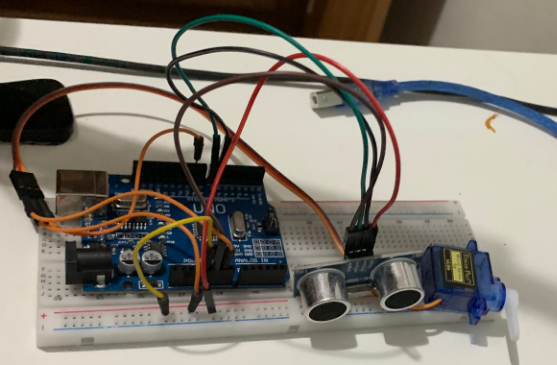

# Projeto de Cancela Automática com Arduino

Este projeto utiliza um **Arduino Uno**, um **sensor ultrassônico** e um **microservo** para criar uma cancela automática. O sensor ultrassônico mede a distância e, se um objeto for detectado a menos de 30 cm, o servo motor move a cancela para abrir (de 100° para 0°) e depois fecha (de 0° para 100°).

## Componentes Usados:
- 1 Arduino Uno
- 1 Sensor Ultrassônico HC-SR04
- 1 Microservo (SG90)
- 1 Protoboard
- 4 Fios macho-macho e macho-fêmea (de cada)

## Como Funciona:
1. O sensor ultrassônico mede a distância em relação a objetos à sua frente.
2. Quando a distância for inferior a 10 cm, o microservo será acionado para abrir a cancela.
3. O servo fica aberto por 1,5 segundos e depois fecha.

## Como Usar:
1. Conecte os componentes conforme as [Instruções de Montagem](#instru%C3%A7%C3%B5es-de-montagem).
2. Faça o upload do código no Arduino.
3. Teste o sensor ultrassônico para ver a cancela abrir e fechar automaticamente.

## Licença:
Este projeto é de código aberto e pode ser utilizado de acordo com a licença MIT.

# Montagem

## Dicas de montagem:
- Use cabos pretos ou azuis para GND e cabos vermelhos para Vcc.
- Mantenha seu projeto organizado.

## Instruções de Montagem:
Pegue seu Arduino Uno e ligue o 5V na parte positiva do protoboard (geralmente indicada na cor vermelha e com o símbolo +);  
Ligue o pino de tensão do motor e do sensor no protoboard;  
Aterre o sensor e o protoboard nos pinos de entrada "GND" do Arduino;  
No sensor, conecte os pinos "Echo" e "Trig" nos pinos de entrada digitais 7 e 6 do Arduino, respectivamente;  
Agora, conecte o pino de saída do motor ao pino digital 9 do Arduino;  
Insira o código do programa e, se tudo correr bem, sua cancela estará pronta.

## Ideia do Projeto
Eu tive essa ideia quando estava no shopping e logo pensei em como poderia fazer uma cancela automática utilizando o Arduino.

### Problemas
No início tive alguns problemas com a montagem, mas após estudar mais sobre cada parte do projeto, consegui realizar a montagem correta com facilidade.  
Também enfrentei problemas com o código, que fazia com que a cancela não parasse de ativar. Felizmente, após consultar meu professor, consegui resolver esses problemas.
